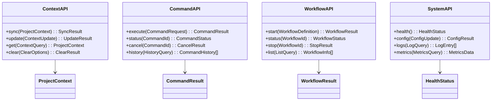

# 🔌 Warp-WebStorm Integration - API Documentation

This document provides comprehensive API documentation with detailed Mermaid diagrams for the Model Context Protocol (MCP) and service interactions.

## 📋 Table of Contents

1. [MCP Protocol Specification](#mcp-protocol-specification)
2. [API Endpoints & Methods](#api-endpoints--methods)
3. [Message Schemas](#message-schemas)
4. [Service APIs](#service-apis)
5. [Error Handling](#error-handling)
6. [Authentication & Security](#authentication--security)
7. [Performance Considerations](#performance-considerations)

---

## MCP Protocol Specification

### Protocol Overview

### Message Flow Patterns

---

## API Endpoints & Methods

### Core MCP Methods

### API Method Details

---

## Message Schemas

### Core Message Structure

### Context Sync Messages

### Command Execution Messages

### Workflow Messages

---

## Service APIs

### JetBrains Plugin Services

### Warp Extension Services

---

## Error Handling

### Error Code Hierarchy

### Error Recovery Flow

---

## Authentication & Security

### Security Model

### Authentication Flow

---

## Performance Considerations

### Performance Metrics & Monitoring

### Optimization Strategies

This comprehensive API documentation with Mermaid diagrams provides detailed technical specifications for implementing and integrating with the Warp-WebStorm Integration MCP protocol and services.
