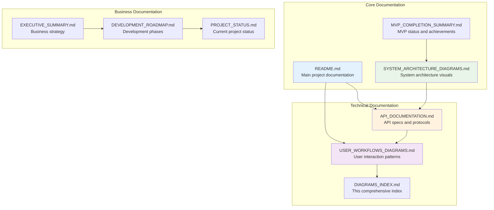
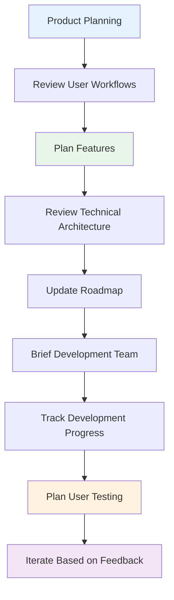
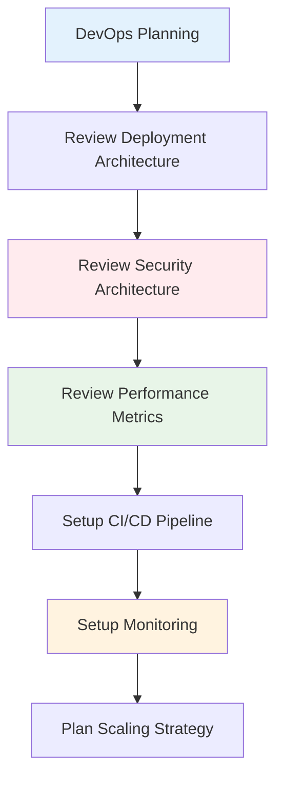
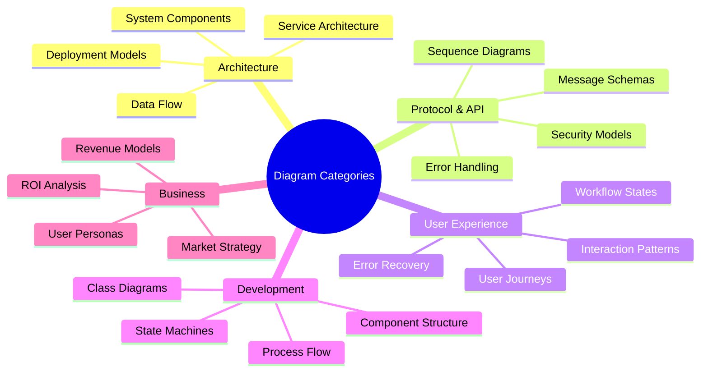

# 📊 Warp-WebStorm Integration - Complete Diagrams Index

This document provides a comprehensive index of all Mermaid diagrams and system documentation created for the Warp-WebStorm Integration MVP project.

## 🗂️ Documentation Structure



---

## 🏗️ System Architecture Diagrams

### High-Level Architecture (`SYSTEM_ARCHITECTURE_DIAGRAMS.md`)

| Diagram | Description | Purpose |
|---------|-------------|---------|
| **High-Level System Architecture** | Complete system overview showing IDE, terminal, and AI integration | Understanding overall system structure |
| **JetBrains Plugin Components** | Detailed plugin architecture with services and actions | Plugin development guidance |
| **Warp Extension Components** | TypeScript extension architecture with AI coordination | Extension development reference |
| **MCP Protocol Flow** | Message flow between IDE and terminal | Protocol implementation guide |
| **Data Models** | Entity relationships and context structures | Database and schema design |

### Sequence Diagrams

| Diagram | Description | Use Case |
|---------|-------------|-----------|
| **IDE Context Sync Flow** | Real-time context synchronization process | Context management implementation |
| **AI Workflow Execution** | Multi-agent workflow coordination | AI system integration |
| **Error Handling Flow** | Error detection and recovery patterns | Error management systems |

### State Diagrams

| Diagram | Description | Application |
|---------|-------------|-------------|
| **MCP Connection States** | Connection lifecycle management | Network layer implementation |
| **AI Workflow States** | Workflow execution state machine | Workflow engine design |
| **Plugin Lifecycle States** | Plugin initialization and lifecycle | Plugin development lifecycle |

### Deployment Architecture

| Diagram | Description | Target Audience |
|---------|-------------|------------------|
| **Local Development Setup** | Development environment configuration | Developers and contributors |
| **Production Distribution** | Marketplace distribution strategy | DevOps and release management |

### Security Architecture

| Diagram | Description | Security Focus |
|---------|-------------|----------------|
| **Authentication & Authorization Flow** | Security layer implementation | Security team and auditors |
| **Threat Model & Mitigation** | Security risks and countermeasures | Security assessment |

---

## 🔌 API Documentation Diagrams

### Protocol Specifications (`API_DOCUMENTATION.md`)

| Diagram | Description | Technical Detail |
|---------|-------------|------------------|
| **MCP Protocol Stack** | Layered protocol architecture | Network protocol implementation |
| **Message Flow Patterns** | Standard message exchange patterns | API integration patterns |
| **Core MCP Methods** | Available API endpoints and methods | API consumer reference |
| **API Method Details** | Detailed method signatures and types | Implementation specification |

### Message Schemas

| Diagram | Description | Data Format |
|---------|-------------|-------------|
| **Core Message Structure** | MCP message format specification | Message parsing implementation |
| **Context Sync Messages** | Context synchronization data flow | Context management APIs |
| **Command Execution Messages** | Terminal command execution protocol | Command execution system |
| **Workflow Messages** | AI workflow coordination messages | Workflow API specification |

### Service APIs

| Diagram | Description | Service Layer |
|---------|-------------|---------------|
| **JetBrains Plugin Services** | Plugin service class diagrams | Plugin architecture reference |
| **Warp Extension Services** | Extension service architecture | Extension development guide |

### Error Handling

| Diagram | Description | Error Management |
|---------|-------------|------------------|
| **Error Code Hierarchy** | Systematic error classification | Error handling implementation |
| **Error Recovery Flow** | Automated error recovery process | Resilience system design |

### Security & Performance

| Diagram | Description | System Quality |
|---------|-------------|----------------|
| **Security Model** | Multi-layer security architecture | Security implementation guide |
| **Authentication Flow** | Detailed authentication sequence | Auth system implementation |
| **Performance Metrics & Monitoring** | Performance tracking architecture | Performance optimization |
| **Optimization Strategies** | System optimization techniques | Performance tuning guide |

---

## 👥 User Workflow Diagrams

### User Journey & Personas (`USER_WORKFLOWS_DIAGRAMS.md`)

| Diagram | Description | User Focus |
|---------|-------------|-------------|
| **Developer Onboarding Journey** | New user adoption process | UX design and training |
| **User Persona Interaction Map** | Different user types and usage patterns | Product management and UX |

### Development Workflows

| Diagram | Description | Development Process |
|---------|-------------|---------------------|
| **Daily Development Workflow** | Typical developer daily routine | Productivity optimization |
| **Code Review Workflow** | Collaborative code review process | Team collaboration |
| **Testing & Debugging Workflow** | Quality assurance processes | QA and testing strategy |

### AI-Assisted Workflows

| Diagram | Description | AI Integration |
|---------|-------------|----------------|
| **AI Workflow Orchestration** | Multi-agent AI coordination | AI system architecture |
| **AI Agent Coordination Patterns** | Agent collaboration patterns | Multi-agent system design |
| **Smart Code Generation Workflow** | AI-powered code generation | Developer productivity |

### Context Synchronization

| Diagram | Description | Context Management |
|---------|-------------|-------------------|
| **Real-time Context Sync Flow** | Context synchronization process | Real-time system implementation |
| **Context Priority Matrix** | Context update prioritization | Performance optimization |

### Error Recovery & Team Collaboration

| Diagram | Description | System Reliability |
|---------|-------------|-------------------|
| **User-Facing Error Recovery** | User error handling experience | UX error handling design |
| **Error Communication Flow** | Error notification and resolution | Support system design |
| **Team Context Sharing** | Collaborative development features | Team productivity features |
| **Collaborative Development Session** | Real-time team collaboration | Pair programming features |

### Advanced Workflows

| Diagram | Description | Power Users |
|---------|-------------|-------------|
| **Custom Workflow Creation** | User-defined workflow system | Advanced customization |
| **Power User Optimization Patterns** | Advanced usage optimization | Expert user features |
| **Advanced Multi-Project Workflow** | Cross-project coordination | Enterprise features |

---

## 📋 Diagram Usage Guide

### For Developers

```mermaid
graph LR
    DEV_START[Start Development] --> ARCH_REVIEW[Review System Architecture]
    ARCH_REVIEW --> API_STUDY[Study API Documentation]
    API_STUDY --> WORKFLOW_UNDERSTAND[Understand User Workflows]
    WORKFLOW_UNDERSTAND --> IMPLEMENT[Begin Implementation]
    
    IMPLEMENT --> CODE_JETBRAINS[Develop JetBrains Plugin]
    IMPLEMENT --> CODE_WARP[Develop Warp Extension]
    
    CODE_JETBRAINS --> REF_PLUGIN_ARCH[Reference Plugin Architecture]
    CODE_WARP --> REF_EXT_ARCH[Reference Extension Architecture]
    
    REF_PLUGIN_ARCH --> TEST_INTEGRATION[Test Integration]
    REF_EXT_ARCH --> TEST_INTEGRATION
    
    TEST_INTEGRATION --> ERROR_HANDLE[Implement Error Handling]
    ERROR_HANDLE --> OPTIMIZE[Performance Optimization]
    
    style DEV_START fill:#e3f2fd
    style IMPLEMENT fill:#e8f5e8
    style TEST_INTEGRATION fill:#fff3e0
    style OPTIMIZE fill:#f3e5f5
```



### For Product Managers



### For UX Designers

```mermaid
graph LR
    UX_START[UX Design Process] --> PERSONA_STUDY[Study User Personas]
    PERSONA_STUDY --> JOURNEY_MAP[Analyze User Journeys]
    JOURNEY_MAP --> WORKFLOW_DESIGN[Design User Workflows]
    WORKFLOW_DESIGN --> ERROR_UX[Design Error Handling UX]
    ERROR_UX --> COLLAB_UX[Design Collaboration Features]
    COLLAB_UX --> PROTOTYPE[Create Prototypes]
    PROTOTYPE --> VALIDATE[Validate with Users]
    
    style UX_START fill:#e3f2fd
    style WORKFLOW_DESIGN fill:#e8f5e8
    style ERROR_UX fill:#fff3e0
    style VALIDATE fill:#f3e5f5
```



### For DevOps Engineers



---

## 🔍 Quick Reference Guide

### Finding Specific Information

| Need | Document | Section |
|------|----------|---------|
| **System Overview** | `SYSTEM_ARCHITECTURE_DIAGRAMS.md` | High-Level System Architecture |
| **API Integration** | `API_DOCUMENTATION.md` | MCP Protocol Specification |
| **User Experience** | `USER_WORKFLOWS_DIAGRAMS.md` | Development Workflows |
| **Error Handling** | `API_DOCUMENTATION.md` | Error Handling |
| **Security Implementation** | `SYSTEM_ARCHITECTURE_DIAGRAMS.md` | Security Architecture |
| **Performance Optimization** | `API_DOCUMENTATION.md` | Performance Considerations |
| **Team Collaboration** | `USER_WORKFLOWS_DIAGRAMS.md` | Team Collaboration Workflows |
| **AI Integration** | `USER_WORKFLOWS_DIAGRAMS.md` | AI-Assisted Workflows |
| **Deployment Strategy** | `SYSTEM_ARCHITECTURE_DIAGRAMS.md` | Deployment Architecture |
| **Business Context** | `EXECUTIVE_SUMMARY.md` | Business Strategy |

### Diagram Categories



---

## 📈 Maintenance & Updates

### Diagram Maintenance Schedule

| Frequency | Activity | Responsibility |
|-----------|----------|----------------|
| **Weekly** | Update workflow diagrams based on user feedback | UX Team |
| **Bi-weekly** | Review and update API documentation diagrams | Development Team |
| **Monthly** | Update system architecture diagrams | Architecture Team |
| **Quarterly** | Comprehensive review of all diagrams | All Teams |
| **Release** | Update deployment and security diagrams | DevOps Team |

### Version Control Strategy

```mermaid
gitgraph:
    options:
    {
        "mainBranchName": "main",
        "theme": "base"
    }
    commit id: "Initial Diagrams"
    branch feature-api-updates
    checkout feature-api-updates
    commit id: "API Diagram Updates"
    checkout main
    merge feature-api-updates
    commit id: "Release v1.1"
    branch feature-user-workflows
    checkout feature-user-workflows
    commit id: "User Workflow Updates"
    checkout main
    merge feature-user-workflows
    commit id: "Release v1.2"
```

---

## 🎯 Success Metrics

### Diagram Effectiveness Tracking

| Metric | Target | Measurement Method |
|--------|--------|--------------------|
| **Developer Adoption** | 90% of developers use diagrams | Survey and analytics |
| **Reduced Onboarding Time** | 50% faster onboarding | Time-to-first-contribution |
| **Fewer Architecture Questions** | 70% reduction in Slack questions | Support ticket analysis |
| **Improved Code Quality** | 30% fewer architecture violations | Code review analysis |
| **Better UX Implementation** | 90% workflow adherence | UX audit compliance |

This comprehensive diagrams index serves as the central navigation point for all visual documentation in the Warp-WebStorm Integration MVP project, ensuring that all stakeholders can quickly find and utilize the appropriate diagrams for their specific needs.
