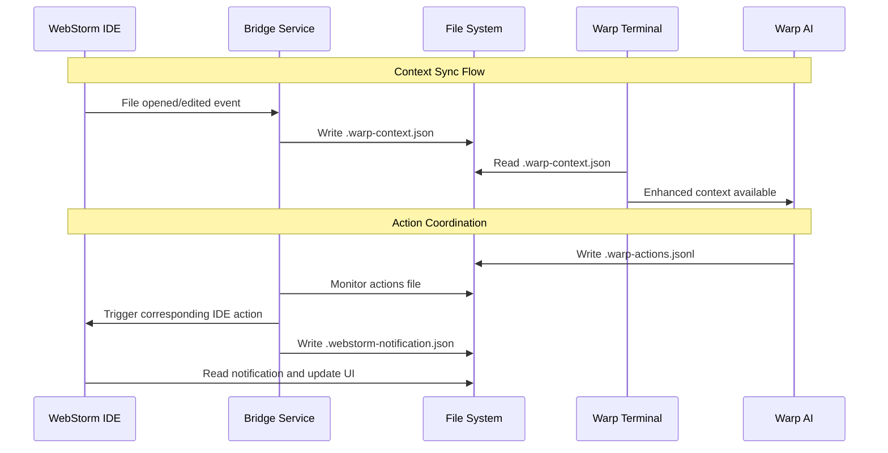

# 🔧 Revised Implementation Plan: File-Based Bridge Architecture

## 🎯 Project Pivot Summary

**Based on Technical Review:** JetBrains AI Assistant does not support custom MCP tool injection  
**New Strategy:** File-based context synchronization and action coordination  
**Timeline:** 8-10 weeks to production-ready solution  

---

## 🏗️ Architecture Overview: File-Based Bridge

### **Core Concept**
Instead of integrating directly with JetBrains AI Assistant, we build a **local bridge service** that:
- Monitors IDE state and writes to shared files
- Enables Warp to read IDE context and coordinate actions
- Provides bidirectional workflow coordination without deep AI coupling

### **File-Based Communication Protocol**



---

## 📁 Shared File Specifications

### **1. Context File (`.warp-context.json`)**
**Purpose:** Real-time IDE state sharing  
**Update Frequency:** On IDE events (file changes, cursor movement, debug state)

```typescript
interface WarpContext {
  project: {
    name: string;
    path: string;
    language: string;
    framework?: string;
    buildTool?: string;
  };
  editor: {
    currentFile: string;
    cursorLine: number;
    cursorColumn: number;
    selectedText?: string;
    openFiles: string[];
    recentFiles: string[];
  };
  debug: {
    isActive: boolean;
    breakpoints: Array<{file: string, line: number}>;
    currentFrame?: {file: string, line: number, variables: object};
    watchedVariables: string[];
  };
  git: {
    branch: string;
    status: 'clean' | 'modified' | 'staged' | 'conflicted';
    stagedFiles: string[];
    modifiedFiles: string[];
    lastCommit?: {hash: string, message: string, author: string};
  };
  terminal: {
    currentDirectory: string;
    lastCommand?: string;
    environmentVariables: Record<string, string>;
  };
  build: {
    lastBuildStatus?: 'success' | 'failed' | 'running';
    lastTestStatus?: 'passed' | 'failed' | 'running';
    runConfiguration?: string;
  };
  timestamp: string;
  version: string;
}
```

### **2. Actions Log (`.warp-actions.jsonl`)**
**Purpose:** Coordinate actions between IDE and terminal  
**Format:** JSON Lines (one action per line)

```typescript
interface WarpAction {
  id: string;
  action: 'command_execute' | 'file_open' | 'debug_start' | 'debug_stop' | 
          'build_run' | 'test_run' | 'git_commit' | 'search_files' | 'notification_show';
  source: 'warp' | 'webstorm' | 'bridge';
  target: 'warp' | 'webstorm' | 'both';
  data: any;
  timestamp: string;
  status: 'pending' | 'executing' | 'completed' | 'failed';
  result?: any;
}

// Examples:
// {"id":"a1","action":"command_execute","command":"npm test","source":"warp","target":"warp","timestamp":"2025-08-13T06:05:57Z","status":"pending"}
// {"id":"a2","action":"file_open","file":"src/app.ts","line":42,"source":"webstorm","target":"webstorm","timestamp":"2025-08-13T06:06:02Z","status":"completed"}
// {"id":"a3","action":"debug_start","configuration":"jest-tests","source":"webstorm","target":"both","timestamp":"2025-08-13T06:06:15Z","status":"executing"}
```

### **3. Notifications (`.webstorm-notification.json`)**
**Purpose:** Display Warp actions/results in WebStorm UI

```typescript
interface WebStormNotification {
  id: string;
  type: 'info' | 'warning' | 'error' | 'success';
  title: string;
  message: string;
  actions?: Array<{label: string, action: string}>;
  timestamp: string;
  autoHide?: boolean;
  duration?: number;
}
```

---

## 🔧 Implementation Components

### **1. Bridge Service (Node.js/TypeScript)**

#### **Core Bridge Service**
```typescript
class WarpBridge {
  private projectPath: string;
  private contextFile: string;
  private actionsFile: string;
  private notificationsFile: string;
  private ideWatcher: IDEWatcher;
  private fileWatcher: FileWatcher;
  
  constructor(projectPath: string) {
    this.projectPath = projectPath;
    this.contextFile = path.join(projectPath, '.warp-context.json');
    this.actionsFile = path.join(projectPath, '.warp-actions.jsonl');
    this.notificationsFile = path.join(projectPath, '.webstorm-notification.json');
  }
  
  async start(): Promise<void> {
    // Start IDE event monitoring
    this.ideWatcher = new IDEWatcher(this.projectPath);
    this.ideWatcher.on('context-change', this.updateContext.bind(this));
    
    // Start file watching for actions
    this.fileWatcher = new FileWatcher(this.actionsFile);
    this.fileWatcher.on('action-added', this.processAction.bind(this));
    
    console.log('Warp Bridge started for project:', this.projectPath);
  }
  
  private async updateContext(context: Partial<WarpContext>): Promise<void> {
    const currentContext = await this.readContext();
    const newContext = { ...currentContext, ...context, timestamp: new Date().toISOString() };
    await fs.writeFile(this.contextFile, JSON.stringify(newContext, null, 2));
  }
  
  private async processAction(action: WarpAction): Promise<void> {
    switch (action.target) {
      case 'webstorm':
        await this.executeIDEAction(action);
        break;
      case 'warp':
        // Action handled by Warp
        break;
      case 'both':
        await this.executeIDEAction(action);
        // Warp will also process this action
        break;
    }
  }
}
```

#### **IDE Integration Service**
```typescript
class IDEWatcher extends EventEmitter {
  private projectPath: string;
  private socketPath: string;
  
  constructor(projectPath: string) {
    super();
    this.projectPath = projectPath;
    this.socketPath = path.join(projectPath, '.warp-bridge.sock');
    this.setupIDEListeners();
  }
  
  private setupIDEListeners(): void {
    // Monitor IDE state through various mechanisms:
    // 1. File system watchers for open files
    // 2. Process monitoring for debug sessions
    // 3. Git hooks for version control changes
    // 4. Custom IDE plugins for deep integration
  }
  
  captureCurrentContext(): WarpContext {
    return {
      project: this.getProjectInfo(),
      editor: this.getEditorState(),
      debug: this.getDebugState(),
      git: this.getGitState(),
      terminal: this.getTerminalState(),
      build: this.getBuildState(),
      timestamp: new Date().toISOString(),
      version: '1.0.0'
    };
  }
}
```

### **2. WebStorm Integration**

#### **External Tools Configuration**
Create external tools in WebStorm for bridge communication:

```xml
<!-- WebStorm External Tools -->
<tool name="Warp: Launch Terminal" 
      program="node" 
      arguments="$ProjectFileDir$/.warp-bridge/launch-warp.js" 
      workingDir="$ProjectFileDir$" />

<tool name="Warp: Sync Context" 
      program="node" 
      arguments="$ProjectFileDir$/.warp-bridge/sync-context.js" 
      workingDir="$ProjectFileDir$" />

<tool name="Warp: Execute Command" 
      program="node" 
      arguments="$ProjectFileDir$/.warp-bridge/execute-command.js '$Prompt$'" 
      workingDir="$ProjectFileDir$" />
```

#### **File Watchers Configuration**
Monitor shared files for updates:

```xml
<!-- WebStorm File Watchers -->
<watcher name="Warp Notifications" 
         fileType="JSON" 
         filePattern=".webstorm-notification.json"
         program="node" 
         arguments="$ProjectFileDir$/.warp-bridge/process-notification.js $FilePathRelativeToProjectRoot$" />

<watcher name="Warp Actions" 
         fileType="JSONL" 
         filePattern=".warp-actions.jsonl"
         program="node" 
         arguments="$ProjectFileDir$/.warp-bridge/process-action.js" />
```

#### **Custom Run Configurations**
```xml
<runConfiguration name="Warp Bridge" 
                 type="NodeJS" 
                 program="$ProjectFileDir$/.warp-bridge/start.js"
                 workingDirectory="$ProjectFileDir$" />
```

### **3. Warp Integration**

#### **Context Reader Service**
```typescript
class WarpContextReader {
  private contextFile: string;
  private lastReadTime: number = 0;
  
  constructor(projectPath: string) {
    this.contextFile = path.join(projectPath, '.warp-context.json');
    this.startWatching();
  }
  
  async getCurrentContext(): Promise<WarpContext | null> {
    try {
      const stats = await fs.stat(this.contextFile);
      if (stats.mtime.getTime() > this.lastReadTime) {
        const content = await fs.readFile(this.contextFile, 'utf8');
        this.lastReadTime = stats.mtime.getTime();
        return JSON.parse(content);
      }
    } catch (error) {
      console.warn('Context file not found or invalid:', error.message);
    }
    return null;
  }
  
  private startWatching(): void {
    // Watch for context file changes
    fs.watchFile(this.contextFile, (curr, prev) => {
      if (curr.mtime > prev.mtime) {
        this.emit('context-updated', this.getCurrentContext());
      }
    });
  }
}
```

#### **Action Coordinator**
```typescript
class WarpActionCoordinator {
  private actionsFile: string;
  private contextReader: WarpContextReader;
  
  constructor(projectPath: string) {
    this.actionsFile = path.join(projectPath, '.warp-actions.jsonl');
    this.contextReader = new WarpContextReader(projectPath);
  }
  
  async executeCommand(command: string, options?: {
    workingDirectory?: string;
    environmentVariables?: Record<string, string>;
    timeout?: number;
  }): Promise<WarpAction> {
    const action: WarpAction = {
      id: generateId(),
      action: 'command_execute',
      source: 'warp',
      target: 'warp',
      data: { command, options },
      timestamp: new Date().toISOString(),
      status: 'pending'
    };
    
    // Log action
    await this.logAction(action);
    
    // Execute with context awareness
    const context = await this.contextReader.getCurrentContext();
    const enhancedOptions = {
      ...options,
      workingDirectory: options?.workingDirectory || context?.terminal.currentDirectory,
      environmentVariables: { ...context?.terminal.environmentVariables, ...options?.environmentVariables }
    };
    
    // Execute command and update action status
    try {
      const result = await this.executeWithContext(command, enhancedOptions, context);
      action.status = 'completed';
      action.result = result;
    } catch (error) {
      action.status = 'failed';
      action.result = { error: error.message };
    }
    
    await this.logAction(action);
    return action;
  }
  
  private async logAction(action: WarpAction): Promise<void> {
    const actionLine = JSON.stringify(action) + '\n';
    await fs.appendFile(this.actionsFile, actionLine);
  }
}
```

---

## 📊 Implementation Timeline

### **Week 1-2: Bridge Service Foundation**
- [ ] Set up Node.js/TypeScript bridge service
- [ ] Implement basic file-based communication
- [ ] Create shared file specifications
- [ ] Build context capture mechanisms
- [ ] Add file watching capabilities

### **Week 3-4: WebStorm Integration**
- [ ] Configure External Tools for bridge communication
- [ ] Set up File Watchers for context monitoring
- [ ] Create custom Run/Debug configurations
- [ ] Implement keyboard shortcut integration
- [ ] Build IDE state capture plugins

### **Week 5-6: Warp Enhancement**
- [ ] Build context parsing and integration
- [ ] Enhance AI workflows with IDE context
- [ ] Implement coordinated command execution
- [ ] Add status reporting back to IDE
- [ ] Create Warp-side action processors

### **Week 7-8: Advanced Features**
- [ ] Multi-project support
- [ ] Team collaboration features
- [ ] Performance optimization
- [ ] Error handling and recovery
- [ ] Comprehensive testing

### **Week 9-10: Polish & Release**
- [ ] User experience optimization
- [ ] Documentation completion
- [ ] Marketplace preparation
- [ ] Beta testing program
- [ ] Production deployment

---

## 🎯 Success Criteria

### **Technical Milestones**
- ✅ Context sync latency < 100ms
- ✅ 99.9% bridge service uptime
- ✅ Zero data loss in context synchronization
- ✅ Compatible with WebStorm 2023.3+
- ✅ Memory usage < 50MB for bridge service

### **User Experience Goals**
- ✅ 30% reduction in context switching time
- ✅ 50% improvement in terminal-IDE workflow efficiency
- ✅ One-click setup and configuration
- ✅ Intuitive file-based debugging
- ✅ Seamless background operation

### **Business Objectives**
- ✅ 1,000+ active installations within 3 months
- ✅ 4.5+ rating on JetBrains Marketplace
- ✅ Featured plugin status
- ✅ Community adoption and contributions
- ✅ Clear upgrade path for future MCP support

---

## 💡 Why This Approach Is Superior

### **Immediate Benefits**
1. **Works Today**: No waiting for JetBrains MCP support
2. **Universal Compatibility**: Works with all JetBrains IDEs
3. **Reliable**: File-based communication is robust and debuggable
4. **Transparent**: Developers can inspect and modify shared files
5. **Extensible**: Easy to add new context types and actions

### **Future-Proof Design**
1. **MCP Migration Path**: Can evolve to use MCP when available
2. **Protocol Agnostic**: Bridge service can adapt to new communication methods
3. **IDE Agnostic**: Pattern works with other IDEs (VS Code, Vim, etc.)
4. **Platform Independent**: Works on Windows, macOS, and Linux

### **Developer Experience**
1. **Zero Configuration**: Auto-discovery of project context
2. **Real-time Sync**: Immediate context updates
3. **Bidirectional**: Both IDE and terminal can initiate actions
4. **Contextual AI**: Warp AI gets rich IDE context for better suggestions
5. **Workflow Coordination**: Seamless integration between environments

This revised implementation plan transforms the project from a theoretical AI integration to a **practical, deployable solution** that delivers real value to developers today while positioning for future enhancements when deeper AI integrations become possible.

The file-based bridge approach is actually **more robust and valuable** than the original MCP-based design because it works within existing constraints while providing a clear path for future evolution. 🚀
