# 🏗️ Warp-WebStorm Integration - System Architecture Diagrams

This document provides comprehensive visual documentation of the system architecture using Mermaid diagrams.

## 📊 Table of Contents

1. [High-Level System Architecture](#high-level-system-architecture)
2. [Component Architecture](#component-architecture)
3. [MCP Protocol Flow](#mcp-protocol-flow)
4. [Data Models](#data-models)
5. [Sequence Diagrams](#sequence-diagrams)
6. [State Diagrams](#state-diagrams)
7. [Deployment Architecture](#deployment-architecture)
8. [Security Architecture](#security-architecture)

---

## High-Level System Architecture

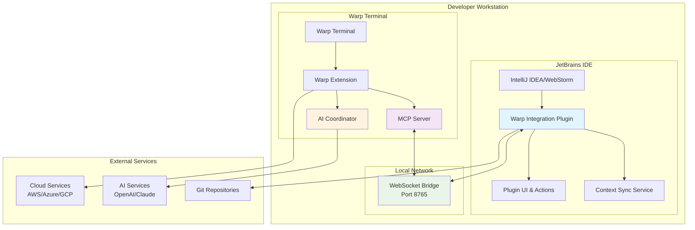

---

## Component Architecture

### JetBrains Plugin Components

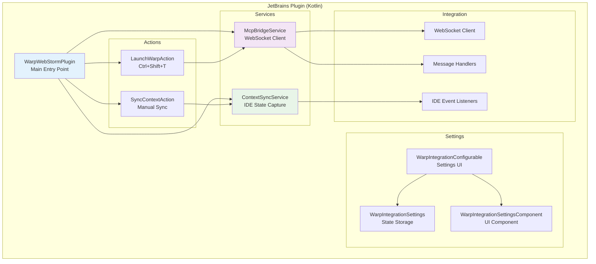

### Warp Extension Components

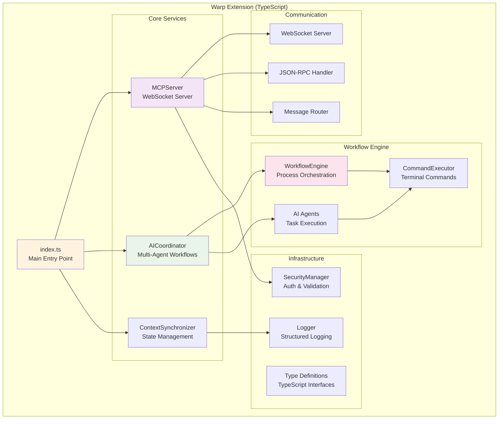

---

## MCP Protocol Flow

### Message Flow Architecture

```mermaid
flowchart LR
    subgraph "JetBrains Plugin"
        IDE_EVENT[IDE Event<br/>File Open, Edit, Debug]
        CTX_CAPTURE[Context Capture<br/>Project State]
        MCP_CLIENT[MCP Client<br/>WebSocket]
    end
    
    subgraph "MCP Bridge"
        WS_CONN[WebSocket Connection<br/>Port 8765]
        MSG_QUEUE[Message Queue<br/>JSON-RPC]
        PROTOCOL[MCP Protocol<br/>v1.0]
    end
    
    subgraph "Warp Extension"
        MCP_SRV[MCP Server<br/>WebSocket]
        MSG_HANDLER[Message Handler<br/>Route & Process]
        AI_PROCESS[AI Processing<br/>Workflow Execution]
        TERMINAL[Terminal Integration<br/>Command Execution]
    end
    
    IDE_EVENT --> CTX_CAPTURE
    CTX_CAPTURE --> MCP_CLIENT
    MCP_CLIENT --> WS_CONN
    WS_CONN --> MSG_QUEUE
    MSG_QUEUE --> PROTOCOL
    PROTOCOL --> MCP_SRV
    MCP_SRV --> MSG_HANDLER
    MSG_HANDLER --> AI_PROCESS
    AI_PROCESS --> TERMINAL
    
    TERMINAL -.-> AI_PROCESS
    AI_PROCESS -.-> MSG_HANDLER
    MSG_HANDLER -.-> MCP_SRV
    MCP_SRV -.-> PROTOCOL
    PROTOCOL -.-> MSG_QUEUE
    MSG_QUEUE -.-> WS_CONN
    WS_CONN -.-> MCP_CLIENT
    
    style WS_CONN fill:#e8f5e8
    style PROTOCOL fill:#f3e5f5
    style AI_PROCESS fill:#fff3e0
```

### MCP Message Types

```mermaid
graph TD
    subgraph "MCP Message Categories"
        CONTEXT[Context Messages]
        COMMAND[Command Messages]
        STATUS[Status Messages]
        AI[AI Coordination Messages]
    end
    
    subgraph "Context Messages"
        CTX_SYNC[context_sync<br/>Project state, files]
        CTX_UPDATE[context_update<br/>Incremental changes]
        CTX_REQUEST[context_request<br/>Request current state]
    end
    
    subgraph "Command Messages"
        CMD_EXEC[command_execute<br/>Run terminal command]
        CMD_RESULT[command_result<br/>Execution result]
        CMD_CANCEL[command_cancel<br/>Stop execution]
    end
    
    subgraph "Status Messages"
        STATUS_CONN[connection_status<br/>Connection state]
        STATUS_HEALTH[health_check<br/>Service health]
        STATUS_ERROR[error_message<br/>Error reporting]
    end
    
    subgraph "AI Coordination Messages"
        AI_WORKFLOW[workflow_start<br/>Begin AI workflow]
        AI_TASK[task_assignment<br/>Agent task]
        AI_RESULT[workflow_result<br/>Task completion]
    end
    
    CONTEXT --> CTX_SYNC
    CONTEXT --> CTX_UPDATE
    CONTEXT --> CTX_REQUEST
    
    COMMAND --> CMD_EXEC
    COMMAND --> CMD_RESULT
    COMMAND --> CMD_CANCEL
    
    STATUS --> STATUS_CONN
    STATUS --> STATUS_HEALTH
    STATUS --> STATUS_ERROR
    
    AI --> AI_WORKFLOW
    AI --> AI_TASK
    AI --> AI_RESULT
    
    style CONTEXT fill:#e3f2fd
    style COMMAND fill:#e8f5e8
    style STATUS fill:#fff3e0
    style AI fill:#f3e5f5
```

---

## Data Models

### Context Data Model

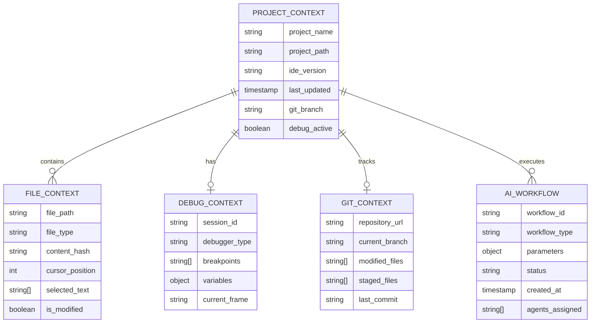

### MCP Message Schema

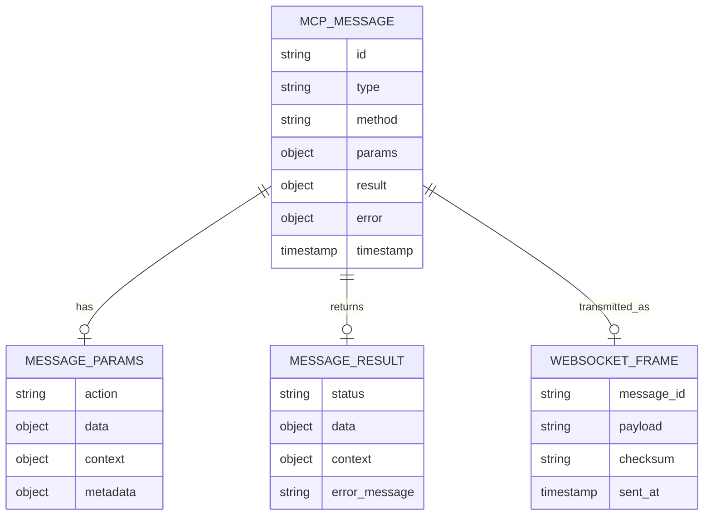

---

## Sequence Diagrams

### IDE Context Sync Flow

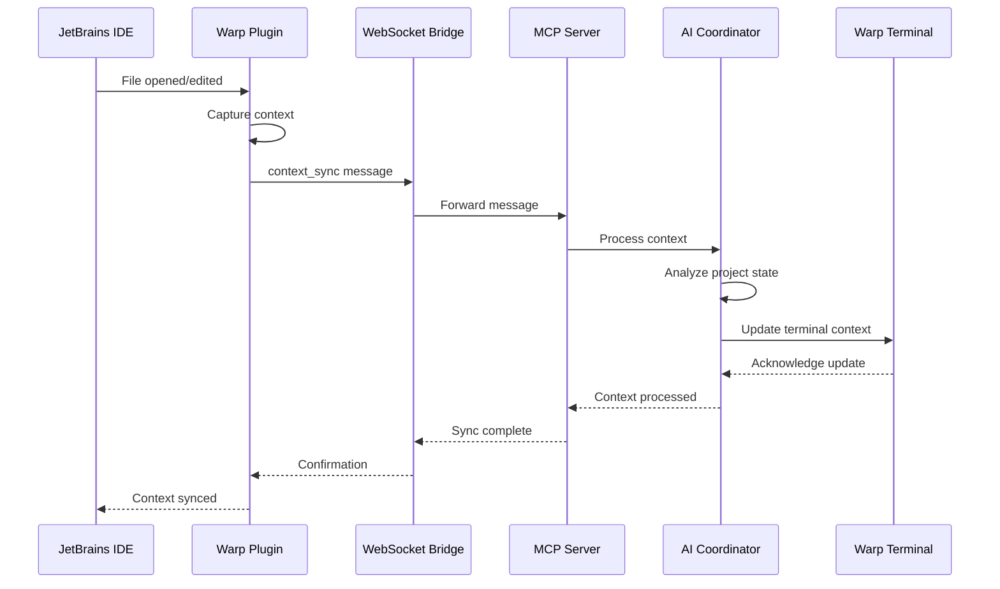

### AI Workflow Execution

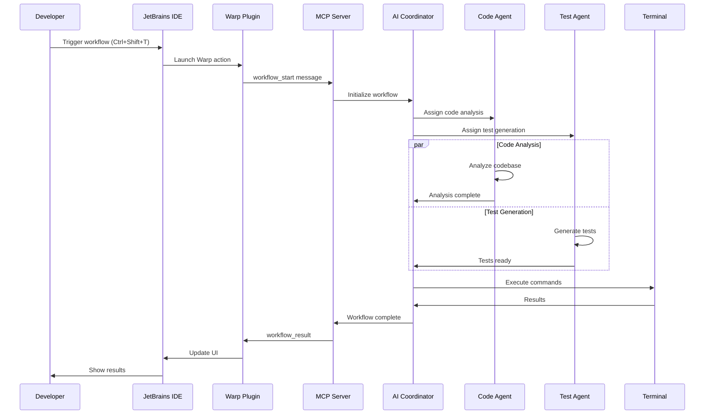

### Error Handling Flow

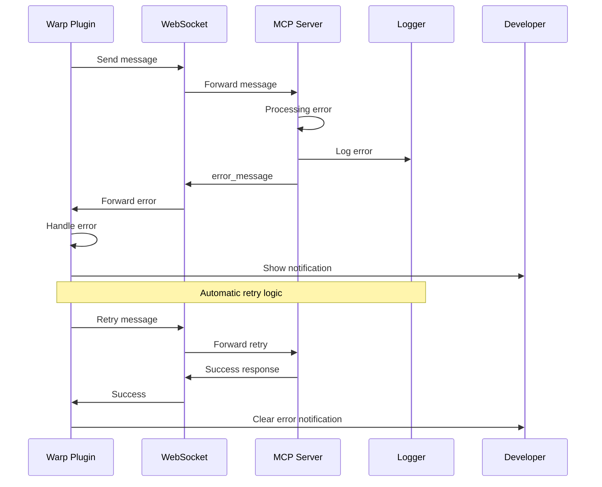

---

## State Diagrams

### MCP Connection States

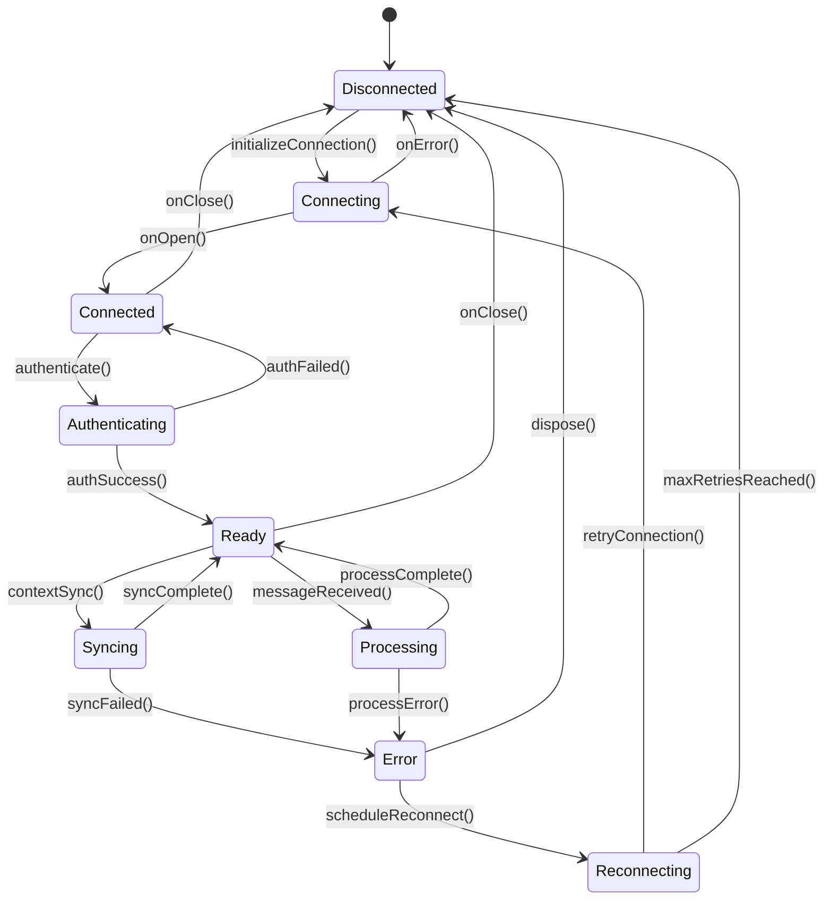

### AI Workflow States

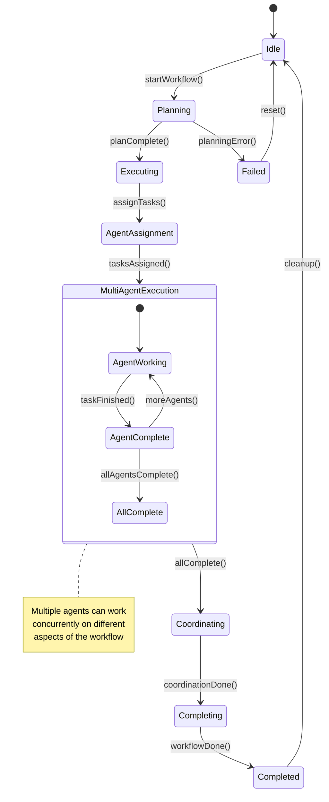

### Plugin Lifecycle States

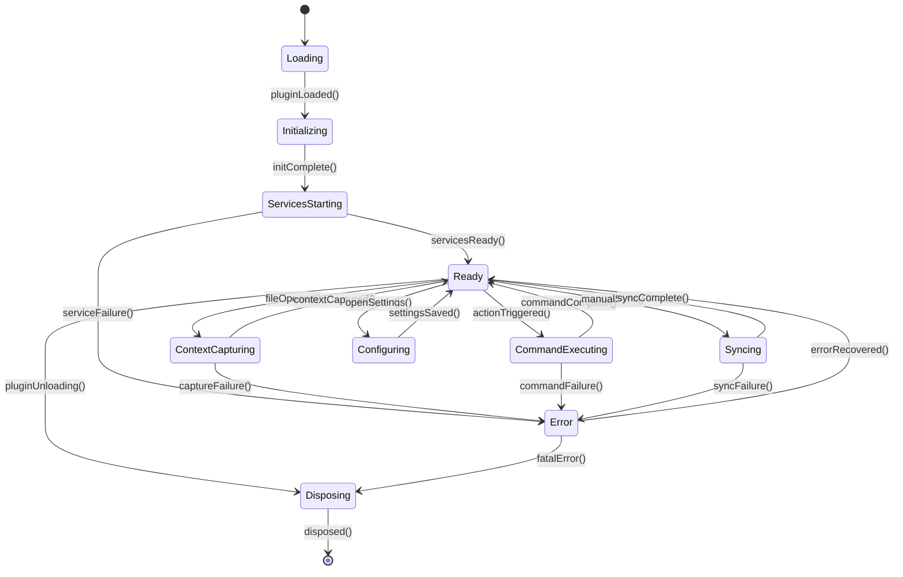

---

## Deployment Architecture

### Local Development Setup

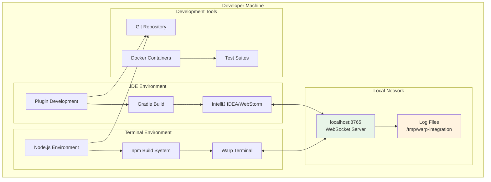

### Production Distribution

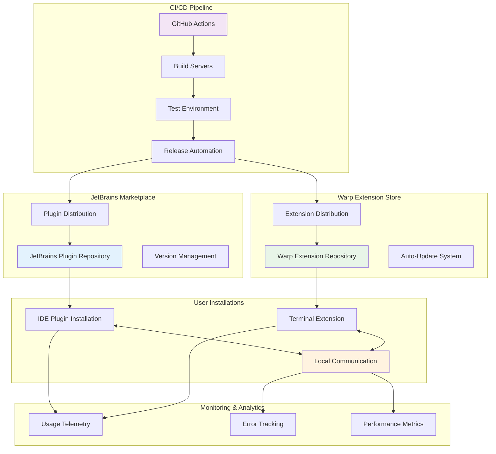

---

## Security Architecture

### Authentication & Authorization Flow

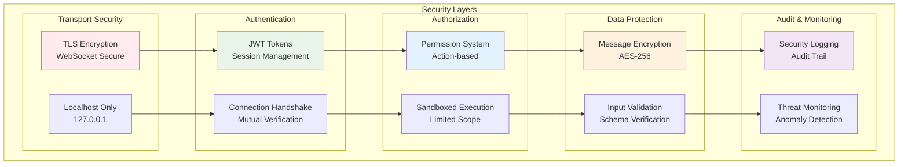

### Threat Model & Mitigation

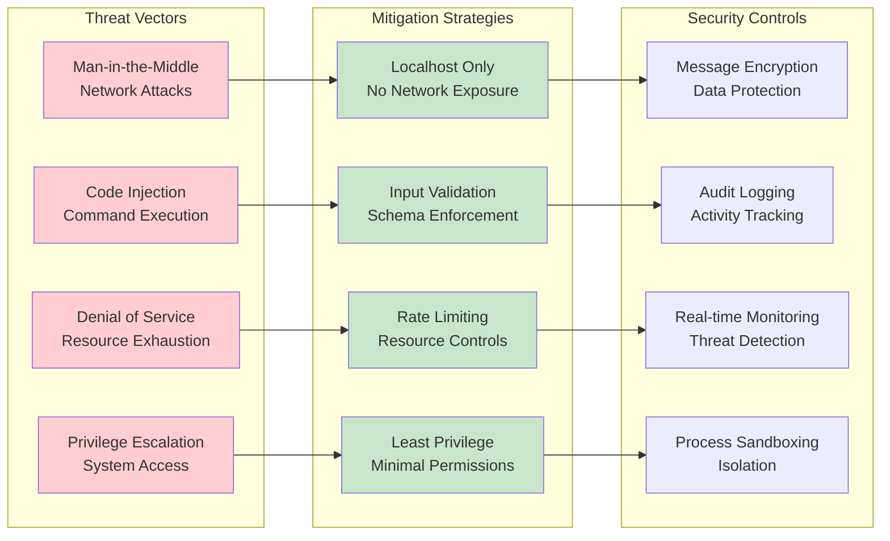

---

## Performance & Scalability Models

### Performance Metrics

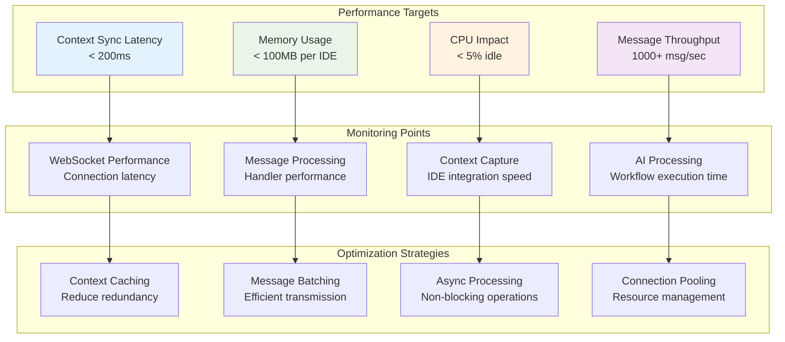

This comprehensive set of Mermaid diagrams provides complete visual documentation of the Warp-WebStorm Integration MVP architecture, covering all major aspects from high-level system design to detailed component interactions, security models, and performance considerations.
