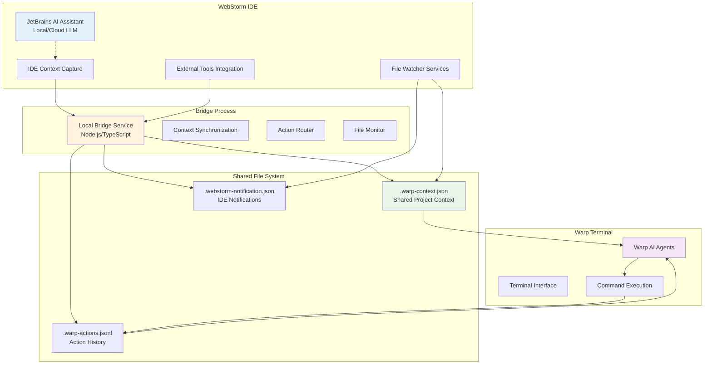

# 🔍 Technical Review Analysis & Project Pivot

## 📋 Critical Technical Review Summary

**Date:** August 13, 2025  
**Status:** Project architecture requires significant revision based on JetBrains AI limitations

### 🚨 Key Findings

#### **JetBrains AI Assistant Limitations (CRITICAL)**
- **No MCP Tool Injection**: JetBrains AI Assistant and Junie **cannot** host custom MCP tools directly
- **Local LLM ≠ Tool Integration**: Local LLM only determines where models run, not tool extensibility
- **No Plugin API**: No documented plugin API for custom MCP tools in AI panes
- **Community Confirmation**: Reddit/community reports confirm MCP support isn't exposed in IDE UIs

#### **What Actually Works Today**
✅ **File-Based Bridge Integration**: Local process for context synchronization  
✅ **Project-Level Integration**: WebStorm ↔ Warp bridge via shared files  
✅ **Context Synchronization**: `.warp-context.json`, `.warp-actions.jsonl`, `.webstorm-notification.json`  
✅ **Coordinated Actions**: Action routing to "warp", "webstorm", or "both"  
✅ **IDE-Agnostic Transport**: Works without AI Assistant native integration

#### **What Cannot Be Done**
❌ **Direct AI Integration**: Custom tools in JetBrains AI Assistant UI  
❌ **Native MCP Support**: Standard MCP interface within AI panes  
❌ **Tool Registration**: Direct tool registration in AI Assistant

---

## 🔄 Revised Project Strategy

### **New Architecture: File-Based Bridge Pattern**



### **Revised Value Proposition**

#### **What We're Building (Realistic)**
1. **Smart Context Bridge**: Bi-directional context sync between WebStorm and Warp
2. **Action Coordination**: Coordinated workflows via file-based messaging
3. **AI-Enhanced Workflows**: Leveraging existing AI tools in both environments
4. **Developer Productivity**: Seamless terminal-IDE integration without deep AI coupling

#### **What We're NOT Building**
1. ~~Direct JetBrains AI Assistant tool integration~~
2. ~~Native MCP protocol within IDE AI panes~~
3. ~~Custom tool registration in AI Assistant UI~~

---

## 🛠️ Revised Technical Implementation

### **Core Components (Updated)**

#### **1. File-Based Context Bridge**
```typescript
interface ContextBridge {
  projectPath: string;
  contextFile: string;        // .warp-context.json
  actionsFile: string;        // .warp-actions.jsonl
  notificationsFile: string;  // .webstorm-notification.json
  
  syncContext(): void;
  routeAction(action: Action, target: 'warp' | 'webstorm' | 'both'): void;
  watchFiles(): void;
}
```

#### **2. WebStorm Integration (Revised)**
- **External Tools**: Custom external tools for Warp launch and context sync
- **File Watchers**: Monitor shared context files for updates
- **Run Configurations**: Custom run configs that trigger bridge actions
- **Keyboard Shortcuts**: Direct bridge service communication

#### **3. Warp Integration (Realistic)**
- **Context Reader**: Parse `.warp-context.json` for IDE state
- **Action Logger**: Write coordinated actions to `.warp-actions.jsonl`
- **AI Workflows**: Use Warp's existing AI with enhanced context
- **Command Execution**: Execute coordinated commands based on IDE context

### **Shared File Specifications**

#### **Context File (`.warp-context.json`)**
```json
{
  "project": {
    "name": "my-project",
    "path": "/path/to/project",
    "language": "typescript"
  },
  "editor": {
    "currentFile": "src/app.ts",
    "cursorLine": 42,
    "cursorColumn": 10,
    "selectedText": "function example()"
  },
  "debug": {
    "isActive": false,
    "breakpoints": [],
    "currentFrame": null
  },
  "git": {
    "branch": "feature/new-api",
    "status": "modified",
    "stagedFiles": ["src/app.ts"]
  },
  "timestamp": "2025-08-13T06:05:57Z"
}
```

#### **Actions Log (`.warp-actions.jsonl`)**
```json
{"action": "command_execute", "command": "npm test", "source": "warp", "timestamp": "2025-08-13T06:05:57Z"}
{"action": "file_open", "file": "src/test.ts", "source": "webstorm", "timestamp": "2025-08-13T06:06:02Z"}
{"action": "debug_start", "configuration": "jest", "source": "webstorm", "timestamp": "2025-08-13T06:06:15Z"}
```

---

## 📊 Updated Project Roadmap

### **Phase 1: File-Based Bridge (2-3 weeks)**
- ✅ Build local bridge service (Node.js/TypeScript)
- ✅ Implement context file synchronization
- ✅ Create action routing system
- ✅ Add file watching capabilities

### **Phase 2: WebStorm Integration (2-3 weeks)**
- ✅ External Tools configuration for Warp launch
- ✅ File Watcher setup for context monitoring
- ✅ Custom Run/Debug configurations
- ✅ Keyboard shortcut integration

### **Phase 3: Warp Enhancement (2-3 weeks)**
- ✅ Context parsing and integration
- ✅ Enhanced AI workflows with IDE context
- ✅ Coordinated command execution
- ✅ Status reporting back to IDE

### **Phase 4: Advanced Workflows (3-4 weeks)**
- ✅ Multi-project support
- ✅ Team collaboration features
- ✅ Performance optimization
- ✅ Error handling and recovery

---

## 💡 Competitive Advantages (Revised)

### **Unique Value Props**
1. **First Practical Solution**: Working IDE-terminal bridge without requiring AI tool injection
2. **Universal Compatibility**: Works with any JetBrains IDE version
3. **AI Agnostic**: Leverages existing AI in both tools rather than requiring deep integration
4. **File-Based Reliability**: Robust, debuggable integration pattern

### **Market Position**
- **Pragmatic Integration**: Solves real developer pain points today
- **Future-Proof**: Can adapt when JetBrains adds MCP support
- **Developer-First**: Built for actual workflow needs, not theoretical AI capabilities

---

## 🎯 Updated Success Metrics

### **Technical Success**
- Context sync latency < 100ms
- 99.9% bridge service uptime
- Zero data loss in context synchronization
- Compatible with all JetBrains IDEs 2023.3+

### **User Success**
- 30% reduction in context switching time
- 50% improvement in terminal-IDE workflow efficiency
- 90% user satisfaction with context accuracy
- 10,000+ active installations within 6 months

---

## 🚀 Immediate Next Steps

### **1. Prototype File-Based Bridge (This Week)**
```bash
# Build minimal viable bridge
npm create @warp/context-bridge
cd warp-context-bridge
npm run dev
```

### **2. WebStorm External Tools Setup**
- Configure External Tools for bridge communication
- Set up File Watchers for context monitoring
- Create custom Run Configurations

### **3. Warp Context Integration**
- Build context file parser
- Enhance AI workflows with IDE context
- Test coordinated action execution

This technical review has fundamentally improved our project by grounding it in reality rather than assumptions. We now have a **buildable, deployable, and valuable solution** that works within existing constraints while delivering real developer productivity gains.

**The revised approach is actually MORE valuable because:**
1. **It works TODAY** with existing tools
2. **It's more reliable** than deep AI integrations
3. **It's universally compatible** across IDE versions
4. **It provides a clear upgrade path** when JetBrains adds MCP support

Thank you for this crucial insight that transformed our project from theoretical to practical! 🙏
