# 👥 Warp-WebStorm Integration - User Workflows & Interaction Diagrams

This document provides comprehensive user workflow documentation with detailed Mermaid diagrams showing how developers interact with the Warp-WebStorm integration system.

## 📋 Table of Contents

1. [User Journey Overview](#user-journey-overview)
2. [Development Workflows](#development-workflows)
3. [AI-Assisted Workflows](#ai-assisted-workflows)
4. [Context Synchronization Patterns](#context-synchronization-patterns)
5. [Error Recovery Workflows](#error-recovery-workflows)
6. [Team Collaboration Workflows](#team-collaboration-workflows)
7. [Advanced Power User Workflows](#advanced-power-user-workflows)

---

## User Journey Overview

### Developer Onboarding Journey

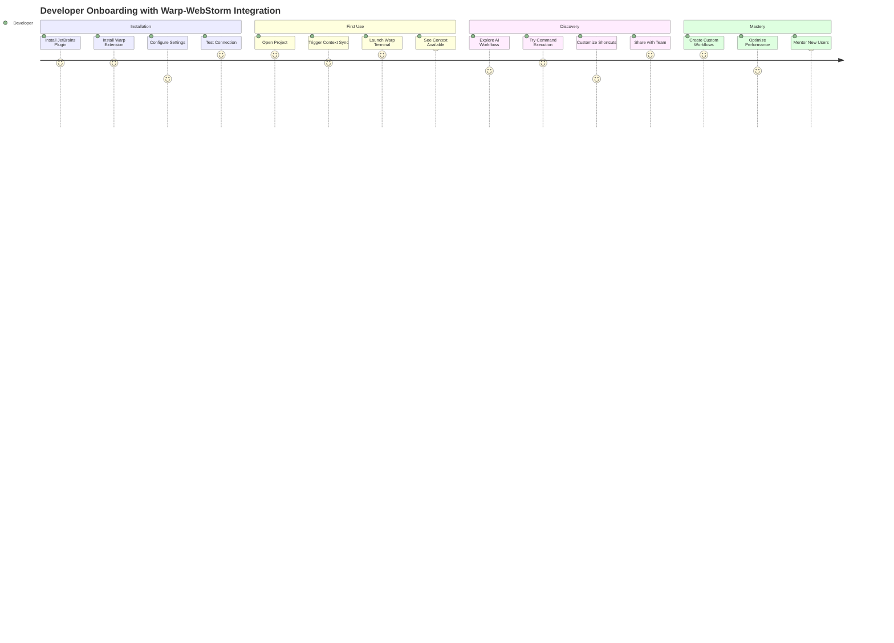

### User Persona Interaction Map

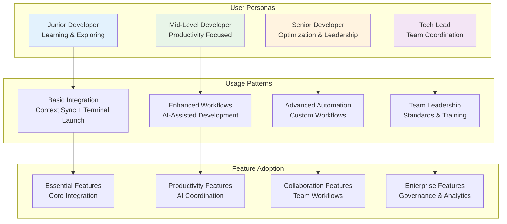

---

## Development Workflows

### Daily Development Workflow

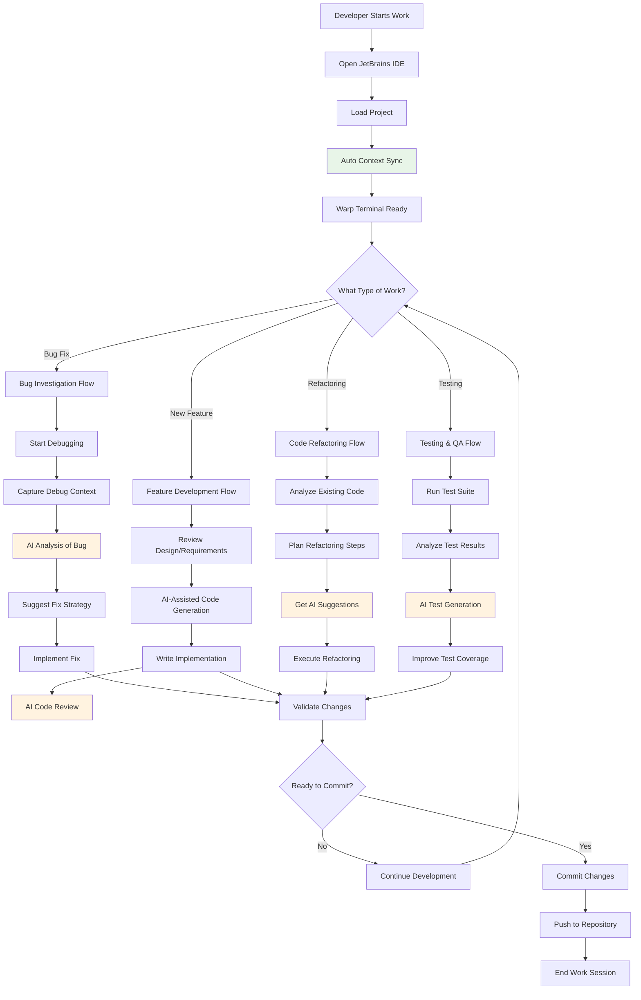

### Code Review Workflow

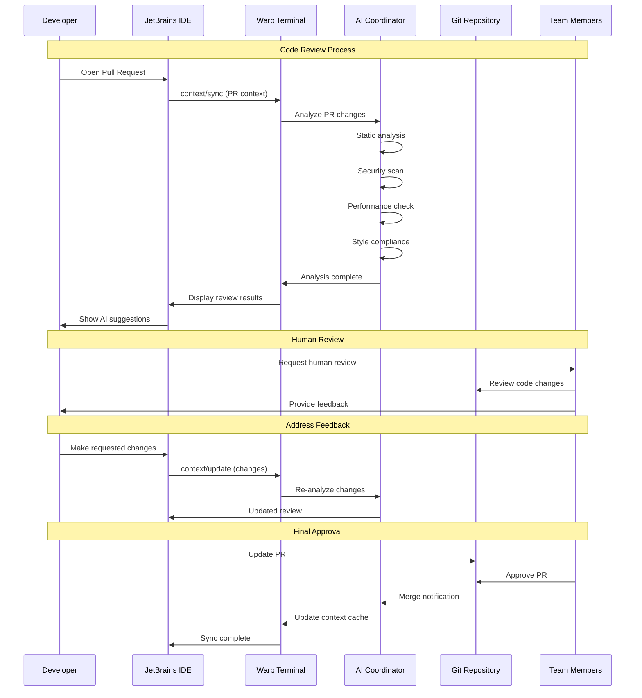

### Testing & Debugging Workflow

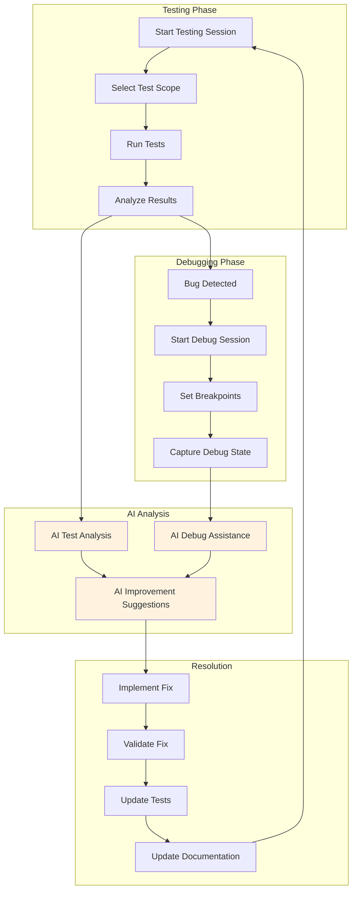

---

## AI-Assisted Workflows

### AI Workflow Orchestration

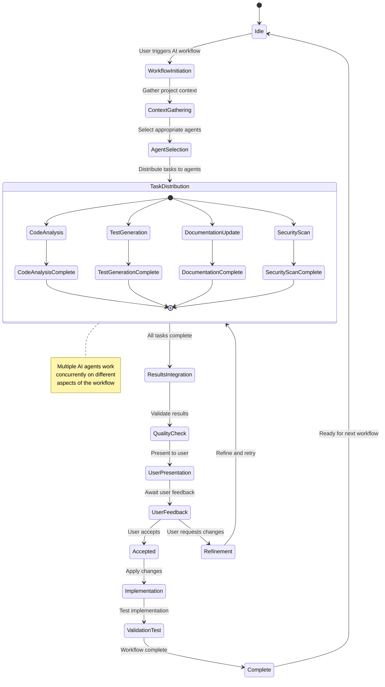

### AI Agent Coordination Patterns

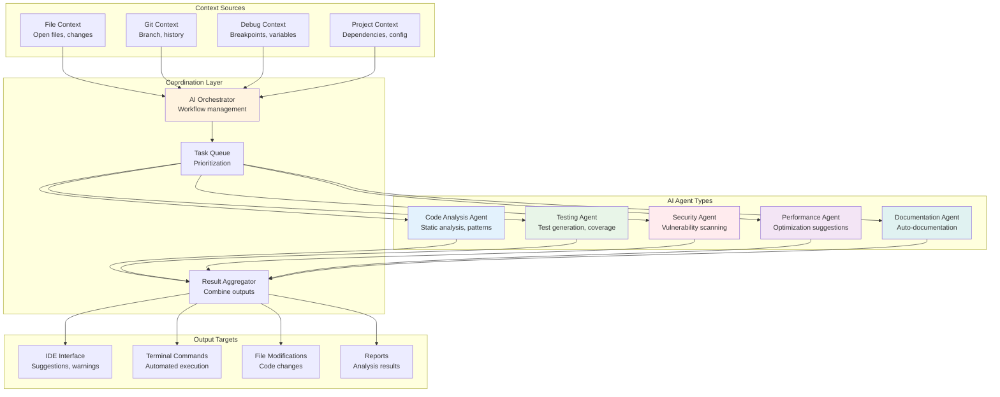

### Smart Code Generation Workflow

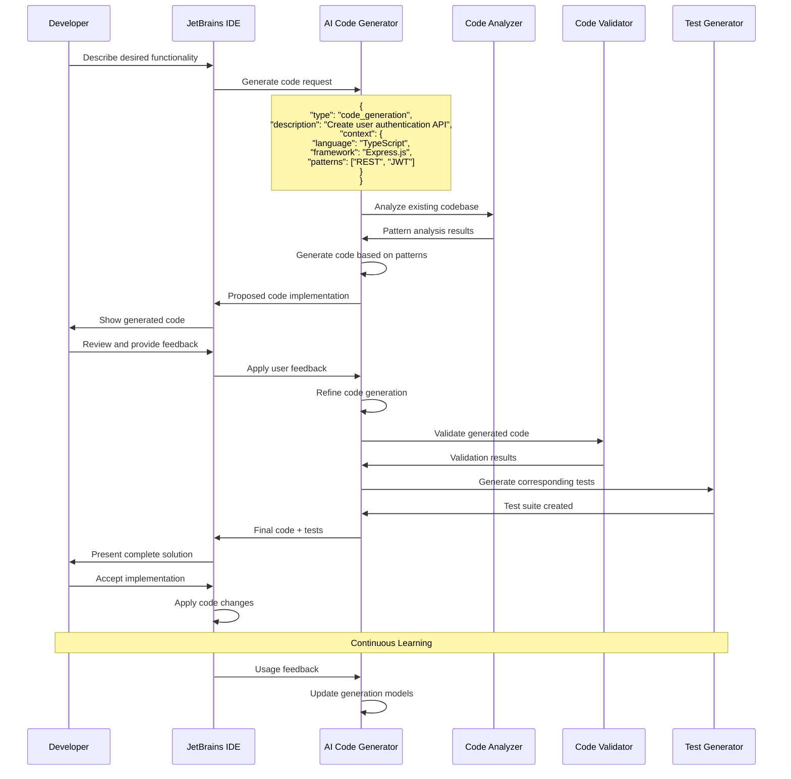

---

## Context Synchronization Patterns

### Real-time Context Sync Flow

```mermaid
flowchart LR
    subgraph "IDE Events"
        FILE_OPEN[File Opened]
        FILE_EDIT[File Edited]
        DEBUG_START[Debug Started]
        GIT_ACTION[Git Action]
        CURSOR_MOVE[Cursor Movement]
    end
    
    subgraph "Context Capture"
        EVENT_LISTENER[Event Listener]
        CTX_BUILDER[Context Builder]
        CHANGE_DETECTOR[Change Detector]
        CTX_CACHE[Context Cache]
    end
    
    subgraph "Sync Decision"
        SHOULD_SYNC{Should Sync?}
        BATCH_CHANGES[Batch Changes]
        IMMEDIATE_SYNC[Immediate Sync]
    end
    
    subgraph "Transmission"
        MSG_BUILDER[Message Builder]
        WEBSOCKET[WebSocket Send]
        COMPRESSION[Compress if Large]
    end
    
    subgraph "Warp Processing"
        MSG_RECEIVE[Receive Message]
        VALIDATE_MSG[Validate Message]
        UPDATE_CTX[Update Context]
        NOTIFY_AI[Notify AI Agents]
    end
    
    FILE_OPEN --> EVENT_LISTENER
    FILE_EDIT --> EVENT_LISTENER
    DEBUG_START --> EVENT_LISTENER
    GIT_ACTION --> EVENT_LISTENER
    CURSOR_MOVE --> EVENT_LISTENER
    
    EVENT_LISTENER --> CTX_BUILDER
    CTX_BUILDER --> CHANGE_DETECTOR
    CHANGE_DETECTOR --> CTX_CACHE
    CTX_CACHE --> SHOULD_SYNC
    
    SHOULD_SYNC -->|High Priority| IMMEDIATE_SYNC
    SHOULD_SYNC -->|Low Priority| BATCH_CHANGES
    BATCH_CHANGES --> IMMEDIATE_SYNC
    
    IMMEDIATE_SYNC --> MSG_BUILDER
    MSG_BUILDER --> COMPRESSION
    COMPRESSION --> WEBSOCKET
    
    WEBSOCKET --> MSG_RECEIVE
    MSG_RECEIVE --> VALIDATE_MSG
    VALIDATE_MSG --> UPDATE_CTX
    UPDATE_CTX --> NOTIFY_AI
    
    style EVENT_LISTENER fill:#e3f2fd
    style SHOULD_SYNC fill:#fff3e0
    style WEBSOCKET fill:#e8f5e8
    style NOTIFY_AI fill:#f3e5f5
```

### Context Priority Matrix

```mermaid
graph TB
    subgraph "Context Priority Levels"
        subgraph "Critical Priority"
            DEBUG_CTX[Debug Session Changes<br/>Immediate sync required]
            ERROR_CTX[Error Conditions<br/>Real-time analysis needed]
            BREAKPOINT[Breakpoint Changes<br/>Debug coordination]
        end
        
        subgraph "High Priority"
            FILE_CHANGES[File Content Changes<br/>Core development work]
            GIT_CHANGES[Git Status Changes<br/>Version control sync]
            PROJECT_CONFIG[Project Config Changes<br/>Build/dependency updates]
        end
        
        subgraph "Medium Priority"
            FILE_SELECTION[File Selection<br/>Navigation context]
            CURSOR_POS[Cursor Position<br/>Location awareness]
            OPEN_FILES[Open Files List<br/>Working set tracking]
        end
        
        subgraph "Low Priority"
            UI_STATE[UI State Changes<br/>Window layout, panels]
            PREFERENCES[Preference Changes<br/>Settings updates]
            METRICS[Usage Metrics<br/>Analytics data]
        end
    end
    
    subgraph "Sync Strategies"
        IMMEDIATE[Immediate Sync<br/>< 50ms delay]
        BATCHED[Batched Sync<br/>1-5 second intervals]
        PERIODIC[Periodic Sync<br/>30 second intervals]
        ON_DEMAND[On-Demand Sync<br/>User or AI triggered]
    end
    
    DEBUG_CTX --> IMMEDIATE
    ERROR_CTX --> IMMEDIATE
    BREAKPOINT --> IMMEDIATE
    
    FILE_CHANGES --> BATCHED
    GIT_CHANGES --> BATCHED
    PROJECT_CONFIG --> BATCHED
    
    FILE_SELECTION --> PERIODIC
    CURSOR_POS --> PERIODIC
    OPEN_FILES --> PERIODIC
    
    UI_STATE --> ON_DEMAND
    PREFERENCES --> ON_DEMAND
    METRICS --> ON_DEMAND
    
    style DEBUG_CTX fill:#ffcdd2
    style FILE_CHANGES fill:#ffecb3
    style FILE_SELECTION fill:#e8f5e8
    style UI_STATE fill:#f3e5f5
```

---

## Error Recovery Workflows

### User-Facing Error Recovery

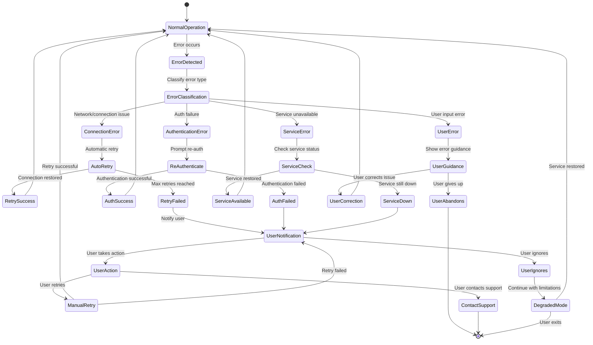

### Error Communication Flow

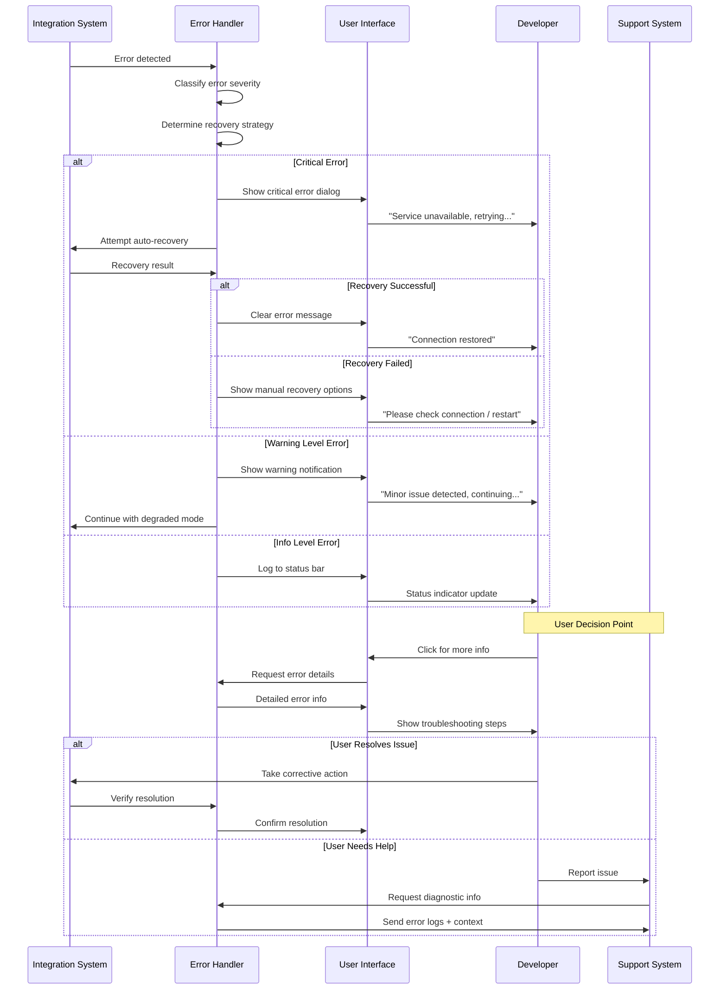

---

## Team Collaboration Workflows

### Team Context Sharing

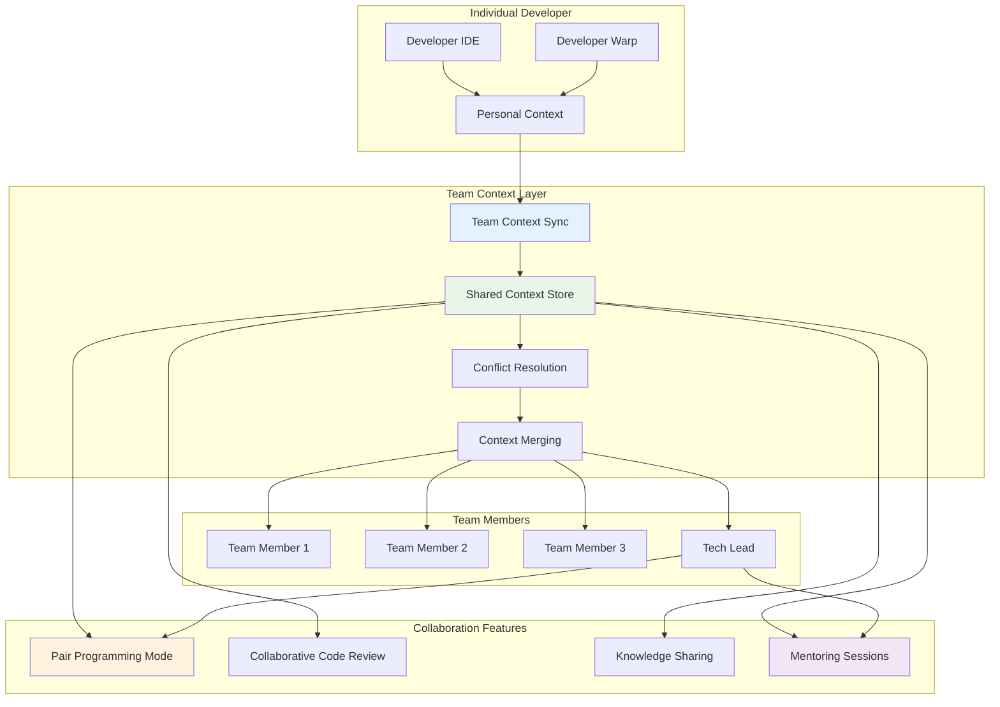

### Collaborative Development Session

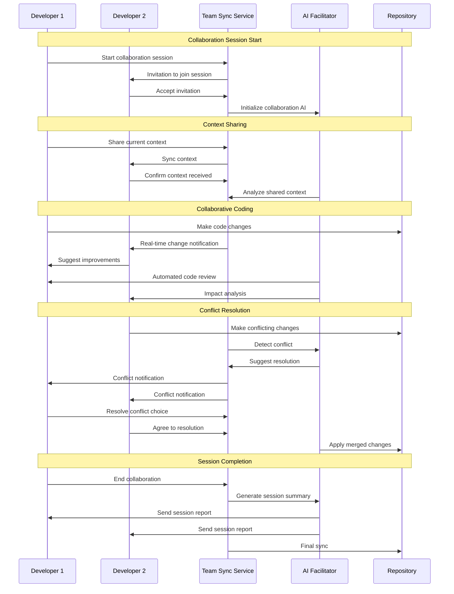

---

## Advanced Power User Workflows

### Custom Workflow Creation

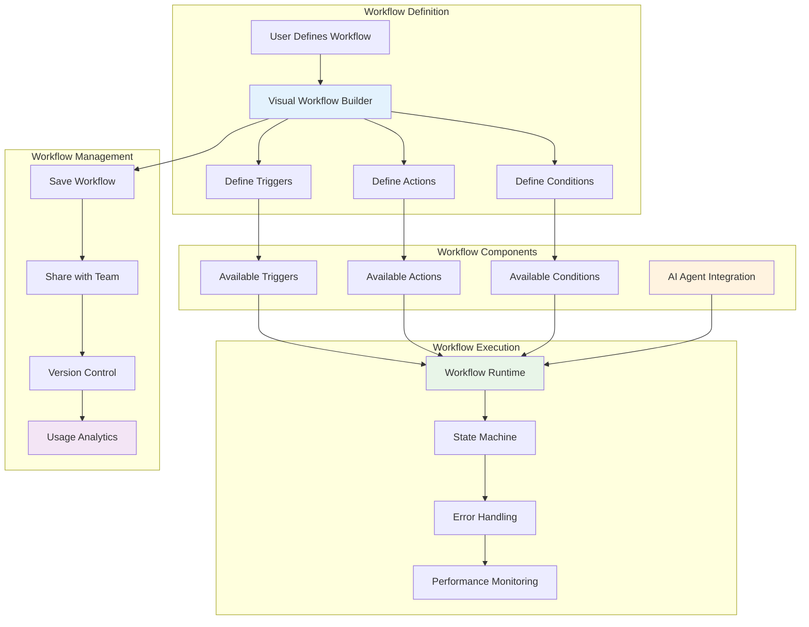

### Power User Optimization Patterns

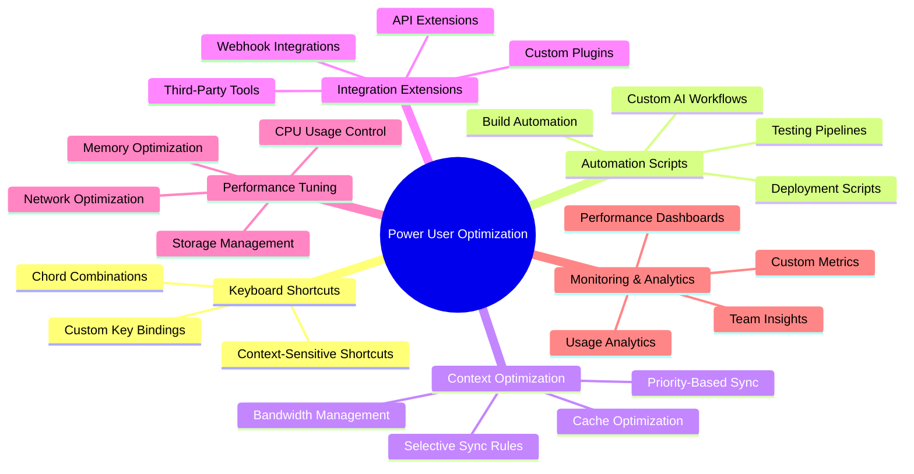

### Advanced Multi-Project Workflow

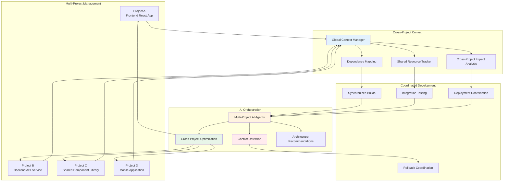

This comprehensive user workflow documentation provides detailed insights into how developers of different skill levels interact with the Warp-WebStorm integration system, from basic usage patterns to advanced power user scenarios.
